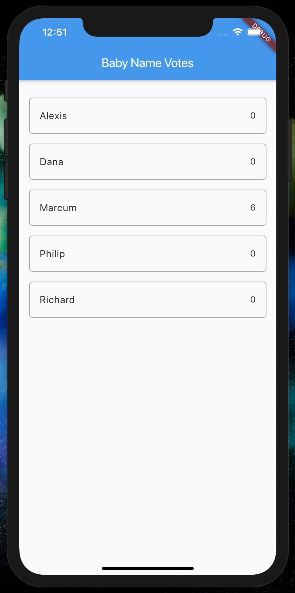

# baby_names
Flutter and Firebase work hand-in-hand to help you build mobile apps in record time. Flutter is Google's SDK for building mobile apps for iOS and Android. Firebase gives you access to backend services for mobile applications—including authentication, storage, database, and hosting—without maintaining your own servers.

In this codelab, you'll learn how to create a Flutter app that uses Firebase. The app helps new parents choose baby names by letting friends and family vote for their favorites. Specifically, the app accesses a Cloud Firestore database, and a user action in your app (i.e., tapping a name option) updates the database atomically.

Here's what the final app will look like on iOS. With Flutter, when you build your app, you can use the same code for both iOS and Android!

